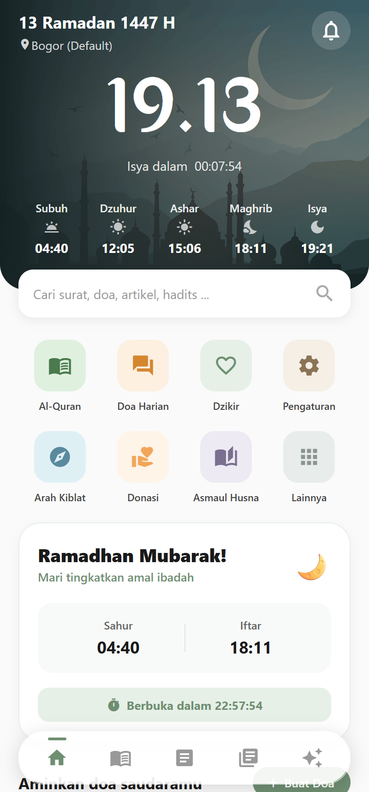
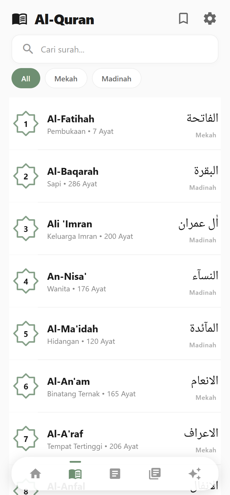
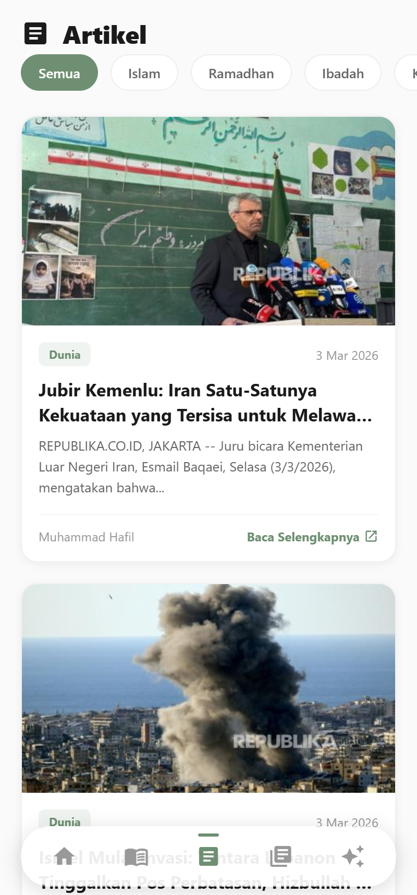
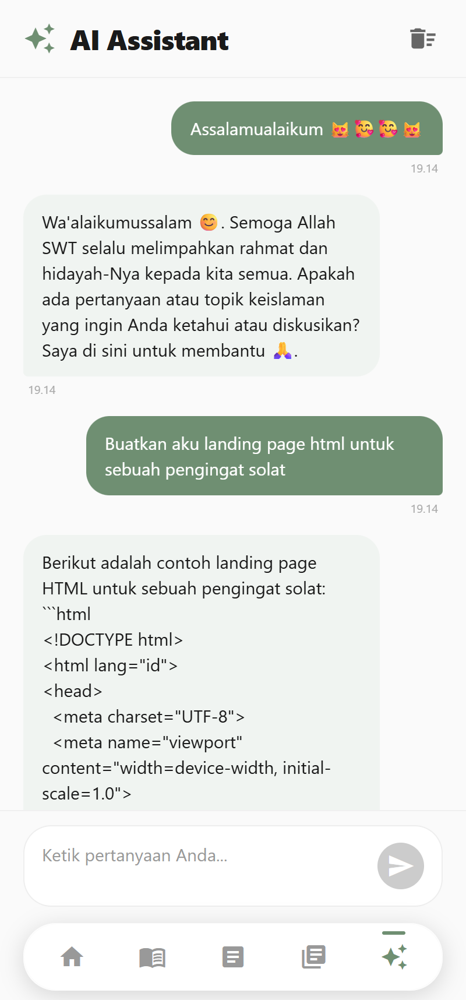
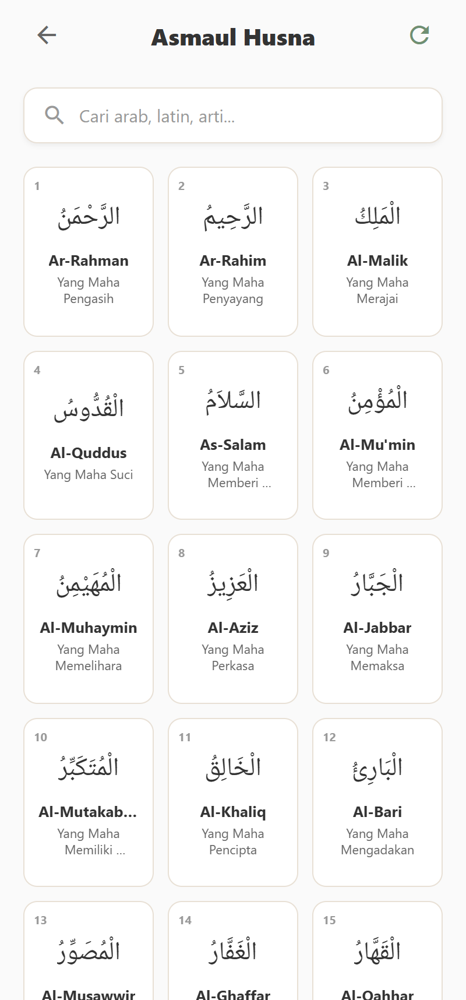

# IslamicApp 🌙

A comprehensive and modern Islamic companion app built with React Native and Expo. This app provides various features to help Muslims in their daily worship and spiritual journey.

## 📱 Screenshots

|                                               |                                               |                                               |
| :-------------------------------------------: | :-------------------------------------------: | :-------------------------------------------: |
|  |  |  |
|  |  |  |
|  |  |  |

---

## ✨ Features

- **📖 Al-Qur'an**: Read Surahs with detailed translations and tafsir. Includes background audio support (works even when the screen is off).
- **🙏 Doa Harian**: Daily prayers and supplications for various occasions.
- **📿 Dzikir**: Digital Tasbeeh and dzikir collections.
- **🕋 Arah Kiblat**: Find the Qibla direction from your location.
- **✨ Asmaul Husna**: The 99 names of Allah with their meanings.
- **🤖 Islamic AI Assistant**: Ask questions and get guidance on Islamic topics.
- **📰 Articles**: Informative Islamic articles and insights.

## 🛠️ Tech Stack

- **Framework**: [React Native](https://reactnative.dev/) with [Expo](https://expo.dev/) (SDK 54)
- **Navigation**: [Expo Router](https://docs.expo.dev/router/introduction/) (File-based Routing)
- **Styling**: Vanilla CSS / React Native Stylesheet
- **Icons**: [@expo/vector-icons](https://docs.expo.dev/guides/icons/)
- **Animations**: [React Native Reanimated](https://docs.swmansion.com/react-native-reanimated/) & [Lottie](https://docs.expo.dev/guides/lottie/)
- **State Management**: React Context API
- **Maps & Location**: [Expo Location](https://docs.expo.dev/versions/latest/sdk/location/)

## 🚀 Getting Started

### Prerequisites

- Node.js (Latest LTS)
- Expo Go app on your phone or an emulator

### Installation

1. Clone the repository:

   ```bash
   git clone https://github.com/satusattr/IslamicApp.git
   ```

2. Install dependencies:

   ```bash
   npm install
   ```

3. Start the development server:

   ```bash
   npm start
   ```

4. Scan the QR code with Expo Go (Android) or Camera app (iOS) to run the app.

---

> 🕒 **Waktu Pengerjaan:** 19 Jam  
> 🏆 **Nilai** : N/A
